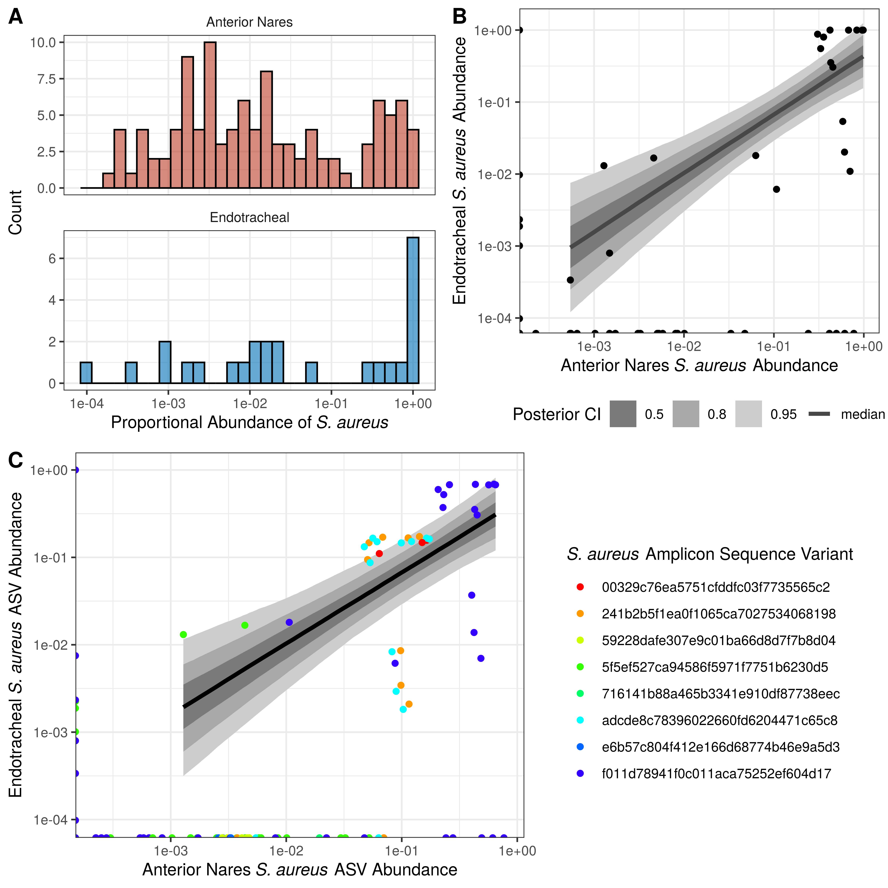
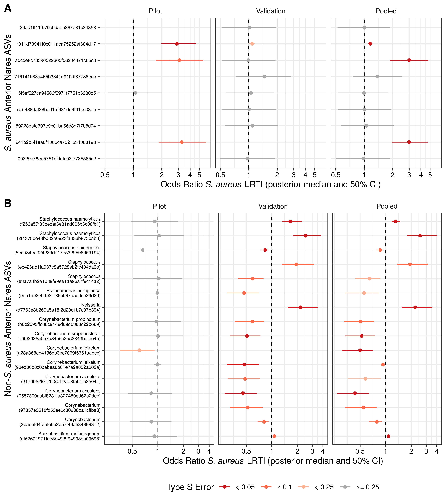
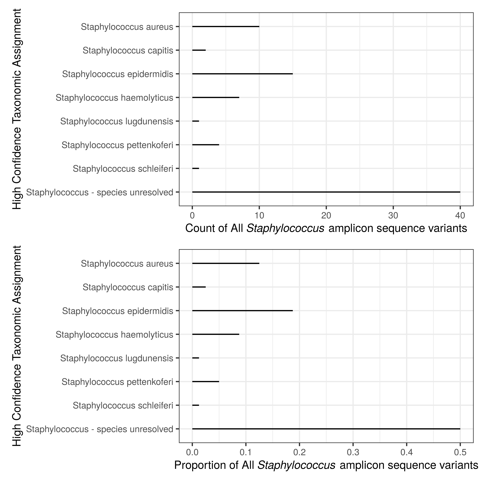
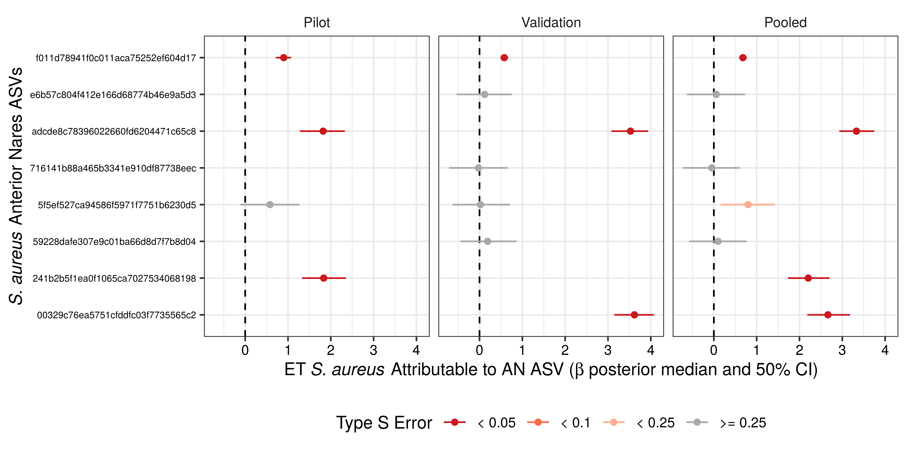

```{r setup, echo=FALSE, eval=TRUE, include=FALSE, autodep=TRUE}

knitr::opts_chunk$set(echo = FALSE, warning = FALSE, message = FALSE)
library(tidyverse)

```
  
```{r table_1, echo=FALSE, eval=TRUE, include=FALSE, autodep=TRUE}

source("./scripts/m_table1.R")


```

```{r validation_AN_missing_ET, eval=TRUE, autodep=TRUE, include=FALSE, fig.align='center'}

source("./scripts/m_validation_nares_pcoa.R")

```
  
```{r shannon_diversity, echo=FALSE, eval=TRUE, include=FALSE, autodep=TRUE}

source("./scripts/m_shannon.R")


```
  
```{r compare_ET_AN, echo=FALSE, eval=TRUE, include=FALSE, autodep=TRUE}

source("./scripts/m_compare_ET_AN_staph.R")


```
  
```{r linear_models, echo=FALSE, eval=TRUE, include=FALSE, autodep=TRUE}

#source("./scripts/m_linear_models.R")


```
  
```{r binomial_models, echo=FALSE, eval=TRUE, include=FALSE, autodep=TRUE}

#source("./scripts/m_binomial_models.R")
source("./scripts/m_binomial_model_plots.R")
#source("./scripts/m_clr_binomial_models_replacement.R")
source("./scripts/m_clr_binomial_plots.R")


```
  
```{r seqvar_analysis, echo=FALSE, eval=TRUE, include=FALSE, autodep=TRUE}

source('./scripts/m_seqvar_analysis.R')

```
  
```{r suppfig_staph_taxonomy, eval=TRUE, include=FALSE, autodep=TRUE, fig.align='center'}

source("./scripts/m_staph_taxonomy.R")

```

  

## Title  
Interspecific interactions define _Staphylococcus aureus_ infection risk during mechanical ventilation  
  
## Abbreviated Title  
Respiratory _Corynebacterium_ and _Staph aureus_  
  
## Authors  
Brendan J. Kelly, MD, MS (1,2); Ebbing Lautenbach, MD, MPH, MSCE (1,2); Jason Roy, PhD (5); Ayannah S. Fitzgerald, BSN (3,4); Layla A. Khatib, BS (3,4); Ize Imai, MS (4); Leigh Cressman, MA (2); Frederic D. Bushman, PhD (3); Ronald G. Collman, MD (3,4)  
  
## Affiliations  
1 - Division of Infectious Diseases, Department of Medicine;  
2 - Department of Biostatistics, Epidemiology, and Informatics;  
3 - Department of Microbiology;  
4 - Division of Pulmonary, Allergy, and Critical Care, Department of Medicine, Perelman School of Medicine, University of Pennsylvania, Philadelphia, PA;  
5 - and Department of Biostatistics and Epidemiology, Rutgers University, New Brunswick, NJ  
  
## Corresponding Author Contact  
Brendan J. Kelly, MD, MS - brendank@pennmedicine.upenn.edu  
  
## Authors' Contributions  
BJK - study design, data collection, data analysis, manuscript preparation;  
EL - study design, manuscript revisions;  
JR - statistical methods, manuscript revisions;   
ASF - subject enrollment, specimen collection, data collection;  
LAK - subject enrollment, specimen collection, data collection;  
II - specimen processing, data collection;  
LC - data collection;  
FDB - study design, manuscript revisions;  
RGC - study design, manuscript revisions     
  
## Disclosures  
The authors report no relevant disclosures.  
  
## Data Availability  
Processed clinical and microbiome data, as well as analysis scripts and model code are available at github.com/bjkellyio. Raw 16S rRNA gene  sequence data have been made publicly available at the National Center for Biotechnology Information's Sequence Read Archive (NCBI SRA) with BioProject ID: PRJNA529220.  
  
## Keywords  
Staphylococcus aureus, Ventilator-Associated Pneumonia, Microbiome, Corynebacterium    
  
-----
\newpage
<P style = "page-break-before: always">
  
## Manuscript  
  
### Abstract  
  
* __Question Addressed__: Intranasal colonization with _Staphylococcus aureus_ ( _Sa_ ) is a marker for increased risk of invasive _Sa_ infection. Prior studies in healthy subjects suggest other nasal bacteria may interact with _Sa_ and impact risk of colonization, but their impact on invasive disease is unknown. We sought to define the relationship between intranasal and respiratory tract microbiota among critically ill subjects dependent on mechanical ventilation and identify features that impact risk of _Sa_ lower respiratory tract infection (LRTI).  
* __Patients and Methods__: We enrolled two prospective cohorts (pilot n = `r micu_cohort %>% filter(grepl("pilot",subject_id)) %>% pull(subject_id) %>% unique() %>% length()`; validation n = `r micu_cohort %>% filter(grepl("validation",subject_id)) %>% pull(subject_id) %>% unique() %>% length()`) of subjects dependent on mechanical ventilation in the medical intensive care unit of an academic medical center. We collected longitudinal  anterior nares (AN) and endotracheal aspirate (ET) specimens to analyze bacterial community composition by 16S ribosomal RNA gene sequencing.  
* __Results__: Three intranasal  _Sa_ amplicon sequence variants (ASVs), which were identified across subjects, cohorts, and sequencing runs, were associated with increased _Sa_ abundance in both AN and ET sites, as well as increased risk for _Sa_ LRTI. Of 597 non- _Sa_ intranasal ASVs, 11 were identified as protective against _Sa_ LRTI, even accounting for the presence of _Sa_ ASVs and prior antibiotic exposure. 8 of 11 (72.7%) protective ASVs were  _Corynebacterium_ species.   
* __Conclusions__: During critical illness and mechanical ventilation, intranasal microbiome features define the risk of _Sa_ ventilator-associated LRTI. Intranasal _Sa_ ASVs associated with high lower respiratory abundance increase risk, but interspecific interactions largely driven by _Corynebacterium_ decrease the risk of invasive disease posed by _Sa_ nasal colonization.    
  
  
-----  
\newpage
<P style = "page-break-before: always">
  
### Introduction:    
  
_Staphylococcus aureus_ (_Sa_) colonizes human skin and mucosa. The anterior nares is the most common site of colonization, but _Sa_ may also reside in the axillae, perineum, and pharynx. Approximately 30% of humans demonstrate persistent intranasal _Sa_ colonization, and intranasal _Sa_ colonization has long been recognized as a marker of risk for invasive infection [@willyard_2017]. Patients admitted to hospitals with intranasal _Sa_ colonization have approximately three-fold increased risk of non-surgical healthcare-associated _Sa_ infection [@dangerfield_2014; @lowy_1998; @solberg_1965; @sollid_2014; @wertheim_2005]. _Sa_ accounts for approximately 20% of cases of ventilator-associated lower respiratory tract infection (VA-LRTI), including pneumonia and tracheobronchitis, with an incidence of approximately 4.5 cases of _Sa_ LRTI per 1000 mechanical-ventilation days [@hurley_2018; @hurley_2018a; @kalanuria_2014; @stulik_2017]. What distinguishes patients with _Sa_ colonization who do or do not develop invasive disease is a gap in current knowledge important for clinical prediction and the design of novel prevention and treatment interventions.   
  
Among healthy adults, interactions between _Sa_ and _Corynebacterium_ species have been shown impact intranasal _Sa_ colonization [@lemon_2010; @yan_2013; @liu_2015; @escapa_2018], and in vitro studies demonstrate _Corynebacterium_ species are capable of attenuating _Sa_ virulence [@ramsey_2016]. However, the impact of interactions among members of the intranasal microbiome on respiratory _Sa_ colonization in critically ill patients, an especially vulnerable population, and particularly on _Sa_ ventilator-associated LRTI, remains undefined [@bomar_2018].  
  
We sequentially enrolled pilot then validation cohorts of critically ill adults who were newly-intubated and dependent on mechanical ventilation. We obtained anterior nares (AN) and endotracheal aspirate (ET) specimens on enrollment and longitudinally for the duration of their critical illness, and we ascertained _Sa_ LRTI outcomes. We first developed models for the impact of nasal _Sa_ strains and interspecific interactions on risk of _Sa_ ventilator-associated LRTI, then validated these models. We found that intranasal colonization with specific _Sa_ sequence variants increases _Sa_ LRTI risk, but that the risk of _Sa_ LRTI associated with intranasal _Sa_ colonization is reduced when _Sa_ is accompanied by specific _Corynebacterium_ sequence variants.    
  
  
-----  
\newpage
<P style = "page-break-before: always">
  
  
### Materials and Methods:  
  
* __Study Design and Setting__: We performed a prospective cohort study, enrolling subjects from the medical intensive care unit of the Hospital of the University of Pennsylvania (HUP), an academic medical center in Philadelphia, PA, USA, within 24 hours of their starting mechanical ventilation. Initial AN and ET specimens were obtained at enrollment, and specimen collection was repeated at 48- to 72-hour intervals thereafter for the duration of mechanical ventilation. Informed consent was obtained from subjects or their surrogates. The protocols were reviewed and approved by the University of Pennsylvania IRB (protocols #817706 and #823392). After an initial, pilot cohort of 14 subjects demonstrated the importance of intranasal _Sa_ ASVs to LRTI risk and suggested a possible protective role for intranasal _Corynebacterium jeikeium_, a validation cohort of 76 subjects was enrolled to further interrogate these findings.       
  
* __Study Population__: Subjects were eligible for inclusion with (1) age >= 18 years, (2) new onset of dependence on intubation and mechanical ventilation, and (3) an anterior nares swab that could be collected within 24 hours of starting mechanical ventilation. Potentially eligible subjects were excluded if they had evidence of _Sa_ lower respiratory tract infection in the 14 days prior to enrollment. In the pilot cohort, `r potential_cohort %>% filter(grepl("pilot",subject_id) & r_Sa_14before_enrollment) %>% pull(subject_id) %>% unique() %>% length()` of `r potential_cohort %>% filter(grepl("pilot",subject_id)) %>% pull(subject_id) %>% unique() %>% length()` potential subjects was excluded for prior _Sa_ infection, yielding `r micu_cohort %>% filter(grepl("pilot",subject_id)) %>% pull(subject_id) %>% unique() %>% length()` total subjects. In the validation cohort, `r potential_cohort %>% filter(grepl("validation",subject_id) & r_Sa_14before_enrollment) %>% pull(subject_id) %>% unique() %>% length()` of `r potential_cohort %>% filter(grepl("validation",subject_id)) %>% pull(subject_id) %>% unique() %>% length()` potential subjects were excluded for prior _Sa_ infection and `r potential_cohort %>% filter(grepl("validation",subject_id) & (days_until_first_AN > 1 | is.na(Sa_detect))) %>% pull(subject_id) %>% unique() %>% length()` potential subjects were excluded because AN specimens could not be collected within 24 hours of enrollment, yielding `r micu_cohort %>% filter(grepl("validation",subject_id)) %>% pull(subject_id) %>% unique() %>% length()` total subjects. All enrolled pilot and validation subjects provided AN specimens at enrollment.  
  
* __Clinical Data Collection__: Using the Penn Data Store, a repository of clinical data compiled from HUP’s electronic medical record, we measured subject demographics, including age, sex, race, and ethnicity; underlying medical diagnoses; antibiotic exposure prior to enrollment; and baseline laboratory values. Clinical respiratory culture data, antibiotic administration data, and vital sign data were captured for 30-days from subject enrollment.   
  
* __Specimen Collection, Data Collection, and Processing__: AN specimens were collected by placing a sterile, flocked swab approximately 2cm inside the anterior nares and contacting the anterior mucosal surface for approximately 30 seconds. ET specimens were collected via the inline suction catheter of the subject’s endotracheal tube. The catheter was first flushed with approximately 5 mL of sterile saline, then advanced into the distal trachea and approximately 5 mL of sterile saline was flushed into the trachea and suctioned back into a Lukens trap. AN and ET specimens were stored immediately on ice and transferred to −80°C storage within 60 min of collection. After DNA extraction (QIAGEN DNeasy Powersoil) and amplification of the V1-V2 16S ribosomal RNA (rRNA) gene hypervariable region (27F - 338R) as previously described [@kelly_2016], we performed paired-end 250bp sequencing (Illumina MiSeq), sequence demultiplexing and alignment (QIIME2), sequence denoising and amplicon sequence-variant (ASV) binning (DADA2 with trimming to bases 13-200). ASVs were used to permit granular analysis and to improve compatibility across studies [@bolyen_2018; @callahan_2016]. Genus-level taxonomic assignments were performed by QIIME 2’s default classifier (Project SILVA_132_SSURef_Nr99 database) [@yarza_2008; @munoz_2011]. We defined ASVs with high-confidence taxonomic assignment to _Sa_ by BLAST alignment to the same SILVA database, with an e-value threshold of 1e-10 (Supplemental Figure 1).  
  
* __Definition of Outcome__: Lower respiratory _Sa_ was defined as the proportional abundance of reads from ASVs with high-confidence _Sa_ taxonomic assignment (linear model). _Sa_ LRTI (binomial model) was defined as the detection of _Sa_ by clinical tracheal aspirate culture (i.e., ordered by clinical care team given suspected infection), in addition to recorded fever (temperature > 100.4°F) or increased/new antibiotic orders within 48 hours of clinical culture order, within 30 days of enrollment.  
  
* __Causal Models__: We investigated two causal models to explain _Sa_ LRTI: (1) based on abundance of intranasal _Sa_ ASVs alone, and (2) based on non- _Sa_ intranasal bacteria, conditional on the abundance of key _Sa_ ASVs and prior antibiotic exposure.  
  
* __Statistical Methods__: Data were organized using R statistical software version 3.6.1 [@rfoundationforstatisticalcomputingrcoreteam_other_2019], and plots generated using the “ggplot2” package [@wickham_2016]. Potential confounders were compared between exposure groups using Wilcoxon rank-sum testing (continuous variables) and Fisher’s exact test (categorical variables). The impact of pre-enrollment antibiotics was assessed with joint species distribution models, using the "jSDM" package, but model convergence was poor and results are not reported [@warton_2015; @brooks_1998]. To permit partial pooling of parameter estimates across ASVs, regularization of ASV effects, and rigorous evaluation of model fit, Bayesian mixed-effects models were fit using Stan Hamiltonian Monte Carlo (HMC) version 2.19 [@mcelreath_2015; @carpenter_2017; @lee_2018; @carney_2019]. Models were fit with 4 chains of 1000 iterations, confirmed with HMC diagnostics (no divergent iterations, no iterations saturating maximum tree depth, Rhat statistic < 1.1 for all parameters, and E-BFMI > 0.2), and by examining the posterior distributions [@gabry_2019]. Regularized horseshoe priors were used to encode the assumption of sparsity among ASV effects and control for false discovery [@piironen_2017]. Univariable models were fit using high-confidence _Sa_ ASVs alone (random effects); multivariable mixed effects models were fit using non- _Sa_ ASVs (random effects) and key _Sa_ ASVs (fixed effects), as well as all recent antibiotic exposures (fixed effects). Binomial models also included an adjustment for variation in per-specimen sequencing depth. Figures highlight parameter estimates associated with ASVs with posterior probabilities of type S error (adjusted for false discovery via regularization, as above) < 0.25, < 0.1, and < 0.05 [@gelman_2000; @storey_2002]. Binomial models were initially fit using scaled ASV abundance data [@robinson_2010]. To further account for the possibility of confounding by compositionality, analyses were repeated after applying the centered log-ratio (CLR) transformation [@gloor_2017].   
  
* __Power and Sample Size__: Based on the number of _Sa_ LRTI cases, as well as the precision of the observed risk associated with _Sa_ ASVs and the protective effects associated with a _Corynebacterium_ ASV in the pilot cohort, we estimated the necessary validation cohort size [@rothman_2018]. Approximately 70 subjects would yield odds ratio certainty intervals with the precision to permit detection of single ASV effects with type S error < 5%; we targeted enrollment of 10% more subjects to allow for a margin of error in that estimate.  
  
* __Secondary Analyses__: Linear models were fit to evaluate the relationship between AN and ET _Sa_ ASVs, restricted to paired, same-day AN and ET specimens. All `r micu_cohort %>% filter(grepl("pilot",subject_id)) %>% pull(subject_id) %>% unique() %>% length()` pilot cohort subjects provided both AN and ET specimens. All validation cohort subjects provided AN specimens, but ET specimens were available for only `r asv_micu_complete %>% filter((subject_id %in% micu_cohort$subject_id) & grepl("validation",subject_id) == TRUE & specimen_type == "ET") %>% pull(subject_id) %>% unique() %>% length()` of them for logistical reasons. (No significant difference was observed in the AN microbiome between validation subjects with or without ET specimens; PERMANOVA/adonis analysis [@anderson_2001] of AN community variance attributable to whether ET specimens could be collected: unweighted Jaccard R^2^ 0.013, unweighted UniFrac R^2^ 0.008, weighted Jaccard R^2^ 0.012, weighted UniFrac R^2^ 0.039).  
  
* __Availability of Data__: Sequence data is publicly available on the National Center for Biotechnology Information’s Sequence Read Archive (NCBI SRA) with BioProject ID: PRJNA529220. Model code, as well as code used to produce the manuscript and figures, is available at github.com/bjkellyio.  
  
  
-----  
\newpage
<P style = "page-break-before: always">
  
  
### Results:  
  
* __Clinical characteristics are similar between critically ill subjects with and without detectable intranasal _Sa___: Baseline characteristics were similar between the exposed (detectable AN high-confidence) _Sa_ ASVs at enrollment) and unexposed (no detectable AN high-confidence _Sa_ ASVs at enrollment) groups in both cohorts, with no statistically significant differences identified in _Sa_-active antibiotic exposure in the 7 days prior to enrollment (Table 1). In the validation cohort, subjects with detectable intranasal _Sa_ were slightly younger with median (IQR) age `r t1_Sa_validation[[1]] %>% as_tibble() %>% filter(variable == "age") %>% pull(stat_2)` years versus `r t1_Sa_validation[[1]] %>% as_tibble() %>% filter(variable == "age") %>% pull(stat_1)` years). `r t1_Sa_validation[[1]] %>% as_tibble() %>% filter(variable == "lymphleuk") %>% pull(stat_2)` carried the diagnoses of leukemia or lymphoma in the _Sa_ group, versus `r t1_Sa_validation[[1]] %>% as_tibble() %>% filter(variable == "lymphleuk") %>% pull(stat_1)` in the group without detectable _Sa_. In the validation cohort, a slightly greater baseline serum creatinine and serum white blood cell (WBC) count were observed among subject with detectable intranasal _Sa_ (Wilcoxon rank-sum p = `r t1_Sa_validation[[1]] %>% as_tibble() %>% filter(variable == "admit_cr") %>% pull(p.value) %>% signif(2)` and p = `r t1_Sa_validation[[1]] %>% as_tibble() %>% filter(variable == "admit_wbc") %>% pull(p.value) %>% signif(2)`, respectively). We observed _Sa_ LRTI events within 30 days of enrollment in `r t1_Sa_pilot[[1]] %>% filter(variable == "r_Sa_30after_enrollment") %>% pull(stat_0)` of pilot cohort subjects, and in `r t1_Sa_validation[[1]] %>% filter(variable == "r_Sa_30after_enrollment") %>% pull(stat_0)` of validation cohort subjects.  
  
* __Intranasal bacterial community diversity is similar across _Sa_ exposure and outcome groups__: We found no significant difference in bacterial community diversity (Shannon index, base e) between exposure groups in the pilot or validation cohorts: median (IQR) Shannon diversity `r shannon_pilot_exposure[[1]] %>% as_tibble() %>% filter(variable == "specimen_shannon") %>% pull(stat_2)` among pilot subjects with detectable _Sa_, and `r shannon_pilot_exposure[[1]] %>% as_tibble() %>% filter(variable == "specimen_shannon") %>% pull(stat_1)` among pilot subjects without (Wilcoxon p-value `r shannon_pilot_exposure[[1]] %>% as_tibble() %>% filter(variable == "specimen_shannon") %>% pull(p.value) %>% signif(3)`; `r shannon_validation_exposure[[1]] %>% as_tibble() %>% filter(variable == "specimen_shannon") %>% pull(stat_2)` among validation subjects with detectable _Sa_, and `r shannon_validation_exposure[[1]] %>% as_tibble() %>% filter(variable == "specimen_shannon") %>% pull(stat_1)` among validation subjects without (Wilcoxon p-value `r shannon_validation_exposure[[1]] %>% as_tibble() %>% filter(variable == "specimen_shannon") %>% pull(p.value) %>% signif(2)`). We likewise found no significant difference in intranasal bacterial community diversity between subjects with and without _Sa_ LRTI within 30 days of enrollment: Shannon diversity (median (IQR)) `r shannon_pilot_outcome[[1]] %>% as_tibble() %>% filter(variable == "specimen_shannon") %>% pull(stat_2)` in pilot subjects with _Sa_ LRTI, `r shannon_pilot_outcome[[1]] %>% as_tibble() %>% filter(variable == "specimen_shannon") %>% pull(stat_1)` in pilot subjects without _Sa_ LRTI (Wilcoxon p-value `r shannon_pilot_outcome[[1]] %>% as_tibble() %>% filter(variable == "specimen_shannon") %>% pull(p.value) %>% signif(2)`); Shannon diversity was `r shannon_validation_outcome[[1]] %>% as_tibble() %>% filter(variable == "specimen_shannon") %>% pull(stat_2)` among validation subjects with _Sa_ LRTI, and `r shannon_validation_outcome[[1]] %>% as_tibble() %>% filter(variable == "specimen_shannon") %>% pull(stat_1)` among validation subjects without _Sa_ LRTI (Wilcoxon p-value `r shannon_validation_outcome[[1]] %>% as_tibble() %>% filter(variable == "specimen_shannon") %>% pull(p.value) %>% signif(2)`).   
  
* ___Sa_ ASVs have a bimodal distribution in the anterior nares and lower respiratory tract__: Heatmaps of family-level taxonomic assignment demonstrated the persistent presence of AN _Staphylococcaceae_ and _Corynebacteriaceae_, and suggested an association between upper and lower respiratory _Staphylococcaceae_ across the total `r asv_micu_complete %>% filter(subject_id %in% micu_cohort$subject_id) %>% select(subject_id, subject_day, specimen_type) %>% distinct() %>% filter(!is.na(specimen_type)) %>% count(specimen_type) %>% filter(specimen_type == "AN") %>% pull(n)` AN and `r asv_micu_complete %>% filter(subject_id %in% micu_cohort$subject_id) %>% select(subject_id, subject_day, specimen_type) %>% distinct() %>% filter(!is.na(specimen_type)) %>% count(specimen_type) %>% filter(specimen_type == "ET") %>% pull(n)` ET specimens collected (Supplemental Figure 2A, 2B). At the ASV-level, we observed longitudinal persistence of subject-specific _Staphylococcus_ and _Corynebacterium_ sequence variants over time (Supplemental Figure 2C, 2D). The proportional abundance of _Sa_ (total 16S rRNA gene reads assigned to high-confidence _Sa_ ASVs divided by all 16S rRNA gene reads per specimen) was bimodally distributed across all AN and ET specimens (Figure 1A). To understand the relationship between _Sa_ proportional abundance at the two sites, we examined all same-day pairs of anterior nares and endotracheal specimens (a total of `r et_an_same_day %>% nrow(.)` same-day paired AN-ET specimens from `r et_an_same_day %>% filter(grepl("pilot",subject_id)) %>% pull(subject_id) %>% unique() %>% length()` pilot and `r et_an_same_day %>% filter(grepl("validation",subject_id)) %>% pull(subject_id) %>% unique() %>% length()` validation cohort subjects). We found a linear relationship between proportional abundance at the two sites, albeit with some outliers (low endotracheal proportional abundance despite high anterior nares proportional abundance; Figure 1B).  
  
* __A subset of _Sa_ ASVs account for high _Sa_ proportional abundance in the anterior nares and lower respiratory tract__: Among `r et_an_asv_same_day_filter %>% pull(seqvar_id) %>% unique() %>% length()` _Sa_ ASVs detected across the paired specimens, four were present at high abundance at both AN and ET sites (Figure 1C). We corroborated this observation by modeling the impact of anterior nares _Sa_ ASV proportional abundance on total lower respiratory _Sa_ proportional abundance. Models were fit independently in each cohort and across the pooled subjects (Supplemental Figure 3). Across all cohorts, we found `r read_csv("./models/linear/staph_model_prop_ET_v_ANsv_reghs_POOLED_seqvar.csv") %>% mutate(typeS5 = typeS_5_neg | typeS_5_pos) %>% filter(typeS5 == TRUE) %>% pull(seqvar_id) %>% unique() %>% length()` high-confidence _Sa_ ASVs with intranasal proportional abundance positively correlated with total ET _Sa_ proportional abundance (posterior type S probability < 0.05).   
  
* __Intranasal _Sa_ ASVs associated with high lower respiratory tract _Sa_ abundance are also associated with increased odds of _Sa_ LRTI__: Given the observed association between specific intranasal _Sa_ ASVs and increased total lower respiratory _Sa_, we evaluated the impact of intranasal _Sa_ ASVs on the outcome of _Sa_ LRTI within 30 days of enrollment and found three of the same _Sa_ ASVs were associated with increased odds of _Sa_ LRTI (Figure 2A). Three of the ASVs had high posterior certainty associations with _Sa_ LRTI risk in the pilot study; only one association reached high posterior certainty in the validation cohort; but all three had very high posterior certainty associations, with type S error (posterior probability of null or negative effect) < 0.05, in the pooled data. Odds ratio (50% posterior credible interval) of 30-day _Sa_ LRTI was `r lrti_binomial_Sa_cohorts %>% filter(cohort == "Pooled" & seqvar_id == "f011d78941f0c011aca75252ef604d17") %>% mutate_at(.vars = vars(mean, se_mean, sd, contains("%")), .funs = ~ exp(.x)) %>% rename_at(.vars = vars(contains("%")), .funs = ~ paste0("posterior_",gsub("%","",.x))) %>% mutate(or_50 = paste0(signif(posterior_50,2)," (",signif(posterior_25,2)," - ",signif(posterior_75,2),")")) %>% pull(or_50)` for the first (ASV ID: f011d78941f0c011aca75252ef604d17), `r lrti_binomial_Sa_cohorts %>% filter(cohort == "Pooled" & seqvar_id == "adcde8c78396022660fd6204471c65c8") %>% mutate_at(.vars = vars(mean, se_mean, sd, contains("%")), .funs = ~ exp(.x)) %>% rename_at(.vars = vars(contains("%")), .funs = ~ paste0("posterior_",gsub("%","",.x))) %>% mutate(or_50 = paste0(signif(posterior_50,2)," (",signif(posterior_25,2)," - ",signif(posterior_75,2),")")) %>% pull(or_50)` for the second (ASV ID: adcde8c78396022660fd6204471c65c8), and `r lrti_binomial_Sa_cohorts %>% filter(cohort == "Pooled" & seqvar_id == "241b2b5f1ea0f1065ca7027534068198") %>% mutate_at(.vars = vars(mean, se_mean, sd, contains("%")), .funs = ~ exp(.x)) %>% rename_at(.vars = vars(contains("%")), .funs = ~ paste0("posterior_",gsub("%","",.x))) %>% mutate(or_50 = paste0(signif(posterior_50,2)," (",signif(posterior_25,2)," - ",signif(posterior_75,2),")")) %>% pull(or_50)` for the third (ASV ID: 241b2b5f1ea0f1065ca7027534068198). For comparison, we also evaluated the _Sa_ LRTI risk associated with lower respiratory tract _Sa_ ASVs detectable on the first day of enrollment (enrollment ET specimens available for all 14 pilot subjects and 15 validation cohort subjects) and found that the same three high-risk _Sa_ ASVs were associated with increased _Sa_ LRTI risk.     
  
* __In the presence of high-risk intranasal _Sa_ ASVs, intranasal _Corynebacterium_ species reduce odds of _Sa_ LRTI__: Having established the risk of _Sa_ LRTI associated with specific intranasal _Sa_ ASVs, we evaluated the impact of the rest of the intranasal microbiome on _Sa_ LRTI. To avoid simply identifying non- _Sa_ ASVs associated with the three high-risk _Sa_ ASVs that we had already identified, we modeled the relationship between intranasal non- _Sa_ ASVs (random effects) and _Sa_ LRTI while conditioning on the abundance of the three high-risk _Sa_ ASVs, as well as prior antibiotic exposure (fixed effects). In the pilot cohort, we found a single protective ASV, assigned to _Corynebacterium jeikeium_. In the validation cohort, we again found a protective _Corynebacterium jeikeium_ ASV, as well as protective ASVs assigned to three other _Corynebacterium_ species (Figure 2B). In summary, we found that among `r lrti_binomial_Sa_ASV_abx_cohorts %>% pull(seqvar_id) %>% unique() %>% length()` non- _Sa_ intranasal ASVs, `r lrti_binomial_Sa_ASV_abx_cohorts %>% filter(typeS_10_neg | typeS_10_pos) %>% pull(seqvar_id) %>% unique() %>% length()` had effects with high posterior certainty (i.e., type S error < 0.1), and `r lrti_binomial_Sa_ASV_abx_cohorts %>% filter(typeS_5_neg | typeS_5_pos) %>% pull(seqvar_id) %>% unique() %>% length()` had effects with very high posterior certainty (i.e., type S error < 0.05) in either the pilot cohort, validation cohort, or pooled subjects. Among the high posterior certainty ASV effects, `r lrti_binomial_Sa_ASV_abx_cohorts %>% filter(typeS_10_pos) %>% pull(seqvar_id) %>% unique() %>% length()` ASVs assigned to the genera _Staphylococcus_, _Neisseria_, and _Cutibacterium_, were associated with increased odds of _Sa_ LRTI. Conversely, `r lrti_binomial_Sa_ASV_abx_cohorts %>% filter(typeS_10_neg) %>% pull(seqvar_id) %>% unique() %>% length()` ASVs were associated with reduced odds of Sa LRTI, even after adjusting for high-risk _Sa_ ASVs and prior antibiotic exposure. `r lrti_binomial_Sa_ASV_abx_cohorts %>% filter(typeS_10_neg) %>% filter(grepl("staphylococcus", tolower(blast_genus))) %>% pull(seqvar_id) %>% unique() %>% length()` of the protective ASVs were assigned to the genus _Staphylococcus_, `r lrti_binomial_Sa_ASV_abx_cohorts %>% filter(typeS_10_neg) %>% filter(grepl("pseudomonas", tolower(blast_genus))) %>% pull(seqvar_id) %>% unique() %>% length()` to the genus _Pseudomonas_, and `r lrti_binomial_Sa_ASV_abx_cohorts %>% filter(typeS_10_neg) %>% filter(grepl("corynebacterium", tolower(blast_genus))) %>% pull(seqvar_id) %>% unique() %>% length()` (`r round(8/11,3) * 100`%) of these were assigned to the genus _Corynebacterium_. To account for potential confounding by compositionality [@gloor_2017], we repeated this analysis after CLR transformation of ASV abundance data. Of 8 protective _Corynebacterium_ ASVs, all remained protective, and 6 with protective effects achieving high posterior certainty, after CLR transformation.   
  
* __The impact of non- _Sa_ ASVs on risk of _Sa_ LRTI align with species-level ASV assignments__: After excluding high-confidence _Sa_ ASVs, `r staph_effects %>% filter(typeS_10_neg|typeS_10_pos) %>% filter(median_OR > 1) %>% pull(seqvar_id) %>% unique() %>% length()` of the `r staph_effects %>% pull(seqvar_id) %>% unique() %>% length()` other _Staphylococcus_ ASVs had high posterior certainty associations with increased odds of _Sa_ LRTI. Two of these three had high-confidence taxonomic assignments to _Staphylococcus haemolyticus_, while species level assignment for the third could not be resolved with high confidence. Of two non- _Sa_ _Staphylococcus_ ASVs strongly associated with decreased odds of _Sa_ LRTI, one had high-confidence taxonomic assignment to _Staphylococcus epidermidis_ and the other's species level assignment could not be resolved with high confidence. In contrast, the impacts of intranasal _Corynebacterium_ ASVs were less species-specific. Among the `r coryn_effects %>% filter(typeS_10_neg|typeS_10_pos) %>% pull(seqvar_id) %>% unique() %>% length()` ASVs assigned to the genus _Corynebacterium_ that demonstrated high posterior certainty (including `r coryn_effects %>% filter(typeS_5_neg|typeS_5_pos) %>% pull(seqvar_id) %>% unique() %>% length()` with very high posterior certainty), all were associated with decreased odds of _Sa_ LRTI. These `r coryn_effects %>% filter(typeS_10_neg|typeS_10_pos) %>% pull(seqvar_id) %>% unique() %>% length()` ASVs included two ASVs with high-confidence assignments to _Corynebacterium jeikeium_; two with high-confidence assignments to _Corynebacterium accolens_; one each with high-confidence assignments to _Corynebacterium propinquum_ and _Corynebacterium kroppenstedtii_; and two ASVs for which species-level assignment could not be resolved with high confidence. Thus, multiple _Corynebacterium_ species and sequence variants within the AN microbiome are linked to reduced risk of _Sa_ LRTI even accounting for the presence of _Sa_ (Supplemental Figure 4).   
  
  
-----  
\newpage
<P style = "page-break-before: always">
  
  
### Discussion:  
  
High-throughput sequencing has demonstrated the capacity for early detection of _Sa_ LRTI [@kelly_2016; @langelier_2019; @prazak_2019]. We extended this method to understand the relationship between the nasal microbiota and lower respiratory tract microbiota during mechanical ventilation and how interspecific interactions impact _Sa_ infection risk, focusing specifically on nasal microbiota and _Sa_ LRTI because nasal microbiota can be assayed non-invasively and it is known that intranasal _Sa_ colonization increases the risk of _Sa_ infection [@lowy_1998; @wertheim_2005]. Recent analysis of the intranasal microbiome have suggested that interactions between _Sa_ and _Corynebacterium_ species are important to _Sa_ colonization itself [@lemon_2010; @yan_2013], but it was unknown whether _Corynebacterium_ or other genera impact _Sa_ infection risk after accounting for its effect on _Sa_ colonization. We report here that specific intranasal _Corynebacterium_ species reduce the risk of _Sa_ LRTI among critically ill patients with intranasal _Sa_ colonization. Our results lay the foundation for novel risk stratification approaches and, potentially, therapeutic interventions, which might target the entire intranasal microbiome, rather than just _Sa_ colonization.   
  
We found a strong association between intranasal and lower respiratory _Sa_ proportional abundance, and we confirmed an association between intranasal _Sa_ abundance and risk for _Sa_ LRTI. We demonstrated that these observed associations were driven by specific _Sa_ 16S rRNA gene ASVs, which were linked to both greater lower respiratory _Sa_ abundance and increased odds of _Sa_ LRTI. Our analysis of non- _Sa_ ASVs corroborated previous reports of interactions between _Sa_ and _Corynebacterium_ species, but importantly showed an impact not just on _Sa_ colonization but also on _Sa_ LRTI. Of 11 intranasal ASVs identified with high confidence as protective against _Sa_ LRTI (even after adjusting for the abundance of high-risk _Sa_ ASVs and prior antibiotic exposure), 8 (72.7%) were assigned to the genus _Corynebacterium_.  
  
_Corynebacterium_ species have previously been demonstrated to attenuate _Sa_ virulence in vitro. In particular, _Sa_ grown with _Corynebacterium striatum_ demonstrates decreased transcription of virulence genes [@ramsey_2016]. But the impact of _Corynebacterium_ - _Sa_ interactions on longitudinal risk for respiratory tract infections was previously unexplored [@bomar_2018]. Our study is the first to demonstrate the clinical impact of _Corynebacterium_ interactions with _Sa_ in the nares, demonstrating reduced odds for _Sa_ ventilator-associated LRTI associated with increased abundance of specific _Corynebacterium_ ASVs, even in the presence of high-risk _Sa_ ASVs. We further demonstrated the impact of non- _Sa_ _Staphylococcus_ species. _Staphylococcus epidermidis_ has previously been shown to protect against _Sa_ colonization [@sullivan_2016]. In our cohorts, a _Staphylococcus epidermidis_ ASV was associated with decreased odds of _Sa_ LRTI, even in the presence of high-risk _Sa_ ASVs. Conversely, two _Staphylococcus haemolyticus_ ASVs were associated with increased odds of _Sa_ LRTI.   
  
Our study has several limitations. Though we enrolled independent pilot and validation cohorts, both were from the same site, thus leaving uncertain the generalizability of our findings. We employed established sequence denoising methods to mitigate high-throughput sequence read errors, and applied mixed effects models with partial pooling of ASV effects to further account for potential misclassification, but our detection of nasal bacterial community members relied upon the 16S rRNA gene sequencing approach, which, unlike shotgun metagenomic analysis, may bias ascertainment of certain community members. Likewise, taxonomic assignments based on 16S rRNA gene sequencing only permit high-confidence assignment of certain reads and are contingent upon the chosen taxonomic database. Finally, we did not evaluate the bacterial community of the oral cavity, raising the question of whether oral _Sa_, _Corynebacterium_ species, and other bacteria may mediate the observed association between nasal and lower respiratory bacterial communities.   
  
In summary, our findings advance the understanding of how intranasal _Sa_ colonization impacts risk for invasive _Sa_ infection during critical care and bolster evidence for the importance of _Sa_ - _Corynebacterium_ interspecific interactions. We demonstrate for the first time the direct impact of key intranasal _Corynebacterium_ ASVs on the odds of _Sa_ LRTI. These associations should be further validated in new populations at risk for _Sa_ LRTI, and explored in populations at risk for other invasive _Sa_ infections. Work must be done to better resolve the identity of intranasal and respiratory tract _Corynebacterium_ species, and to investigate the mechanisms of interactions between specific _Corynebacterium_ species and _Sa_. Nevertheless the study's findings lay the foundation for novel risk stratification tools, which incorporate more complete measures of the intranasal microbiome, and raise the possibility of novel therapeutic interventions, which might mitigate risk for _Sa_ respiratory tract infection by modifying the entire intranasal microbiome, rather than just intranasal _Sa_.   
  
  
  
-----
\newpage
<P style = "page-break-before: always">
  
  
### Acknowledgements:  
BJK is supported by the National Institute for Allergy and Infectious Diseases (K23 AI121485 and L30 AI120149), as well as Centers for Disease Control and Prevention (CDC) contract awards (BAA 200-2016-91964 and 200-2018-02919). BJK and EL are supported by the CDC Healthcare-Associated Infection Prevention Epicenters Program (U54CK000485). RGC and FDB are supported by R33HL137063. We acknowledge financial and other support from the Penn-CHOP Microbiome Program and the Penn Center for AIDS Research (P30AI045008).  
  
  
-----
\newpage
<P style = "page-break-before: always">
  
  
### Tables:  
  
#### Table 1:  
  
```{r table1_pilot, eval=TRUE, autodep=TRUE, fig.align='center'}

#t1_Sa_pilot

```
  
```{r table1_validation, eval=TRUE, autodep=TRUE, fig.align='center'}

#t1_Sa_validation

```
  
__Table 1: Subject characteristics.__ Subject demographics, laboratory values at day of enrollment, medical comorbidities, and recent antibiotic exposures are presented for the pilot and validation cohorts. For categorical variables, counts and proportions are given; for continuous variables, medians and interquartile ranges are given. Subjects in both cohorts are compared by whether _Sa_ was detected by AN 16S rRNA gene sequencing at enrollment. Categorical values are compared with Fisher’s exact test; continuous variables are compared with Wilcoxon rank-sum tests. (WBC: white blood cell count; AST: aspartate aminotransferase; ALT: alanine aminotransferase; COPD: chronic obstructive pulmonary disease; ILD: interstitial lung disease).  
  
  
-----  
\newpage
<P style = "page-break-before: always">
  
### Figures:  
  
#### Figure 1:  
  
  
```{r fig1, eval=TRUE, autodep=TRUE, fig.align='center', out.width='90%'}

# {align='center'}  
knitr::include_graphics(path = "./figs/main/p_et_v_an_combined.svg")


```
  
  
__Figure 1: Relationship between _Staphylococcus aureus_ proportional abundance in the anterior nares and lower respiratory tract.__ (A) Across all AN and ET specimens collected, we observed a bimodal distribution of _Sa_ proportional abundance. (B) Relationship between ET _Sa_ proportional abundance and AN _Sa_ proportional abundance among a subset of all pairs of specimens that were collected on the same day (`r et_an_same_day %>% nrow(.)` pairs across `r et_an_same_day %>% pull(subject_id) %>% unique() %>% length()` subjects). Each dot represents an ET-AN specimen pair; the black line depicts the prediction of a linear model fit to the pairs, and the gray band depicts the model’s posterior certainty intervals. (C) The same comparison between ET and AN specimen pairs, but here depicting the proportional abundance of each detected _Sa_ ASV, rather than aggregate _Sa_ proportional abundance. As above, each dot represents a specimen pair, the line depicts a linear model fit to the pairs, and the gray band shows the model’s posterior certainty interval.  
  
  
  
-----  
\newpage
<P style = "page-break-before: always">
  
  
#### Figure 2:  
  
  
```{r fig2, eval=TRUE, autodep=TRUE, fig.align='center', out.width='90%'}

# {align='center'}  
knitr::include_graphics(path = "./figs/main/p_lrti_model_combined.svg")


```
  
  
__Figure 2: Relationship between _Staphylococcus aureus_ LRTI observed within 30-days of enrollment and anterior nares microbiome features on enrollment.__ (A) Parameter estimates from a mixed effects binomial model evaluating only the 9 high-confidence _Sa_ AN ASVs observed across the pilot and validation subjects on the day of enrollment. The horizontal axis depicts the odds ratio of _Sa_ LRTI on a logarithmic scale. The points indicate parameter medians, and the horizontal lines indicate parameter 50% posterior credible intervals. The broken vertical line above 1 indicates the null effect (odds ratio of 1). The color indicates parameters for which the posterior type S error is < 0.05, < 0.1, or < 0.25. (B) The parameter estimates from a mixed effects binomial model evaluating non- _Sa_ ASVs (random effect), while adjusting for known high-risk _Sa_ ASVs and prior antibiotic exposure (fixed effects). The figure only includes ASVs with a posterior type S error < 0.1; the color indicates parameters for which the posterior type S error (which accounts for multiple comparisons) is < 0.05, < 0.1, or < 0.25.   
  
  
    
-----  
\newpage
<P style = "page-break-before: always">
  
  
  
### Supplemental Figures:  
  
#### Supplemental Figure 1:  
  
  
```{r sfig1, eval=TRUE, autodep=TRUE, fig.align='center', out.width='90%'}

# {align='center'}  
knitr::include_graphics(path = "./figs/supp/p_Sa_taxonomy.svg")


```
  
  
__Supplemental Figure 1: High-confidence _Staphylococcus aureus_ taxonomic assignment from 16S rRNA gene sequence data.__ The top panel depicts the count of all ASVs with genus-level assignment to _Staphylococcus_, and the species to which they were assigned. The bottom panel depicts the same, but with assignments shown as a proportion of all _Staphylococcus_ ASVs.  
  
  
-----  
\newpage
<P style = "page-break-before: always">
  
  
#### Supplemental Figure 2:  
  
```{r sfig2, eval=TRUE, autodep=TRUE, fig.align='center', out.width='90%'}

# {align='center'}  
knitr::include_graphics(path = "./figs/supp/p_heatmap_combined.svg")


```
  
  
__Supplemental Figure 2: Bacterial community composition in the anterior nares and endotracheal aspirates of critically ill subjects dependent upon mechanical ventilation.__ Heatmaps depict the proportional abundance of (A) bacterial families across 266 anterior nares specimens and (B) bacterial families across 123 endotracheal aspirate specimens. The anterior nares bacterial community is further characterized by heatmaps depicting (C) all _Staphylococcus_ ASVs and (D) all _Corynebacterium_ ASVs. Specimens are arranged from left to right in order of collection; vertical white lines separate subjects.    
  
  
  
-----  
\newpage
<P style = "page-break-before: always">
  
  
#### Supplemental Figure 3:  
  
```{r sfig3, eval=TRUE, autodep=TRUE, fig.align='center', out.width='90%'}

# {align='center'}  
knitr::include_graphics(path = "./figs/supp/p_sa_linear_cohorts.svg")


```
  
  
__Supplemental Figure 3: Relationship between total lower respiratory tract _Staphylococcus aureus_ proportional abundance and the proportional abundance of _Staphylococcus aureus_ sequence variants detected in the anterior nares.__ Parameter estimates from a mixed effects linear model are depicted for the `r et_an_asv_same_day_filter %>% pull(seqvar_id) %>% unique() %>% length()` _Sa_ ASVs observed across pilot and validation subjects with paired (same day) AN and ET specimens. The horizontal scale is fold change in ET _Sa_ proportional abundance. The points indicate parameter medians, and the horizontal lines indicate parameter 50% posterior credible intervals. The broken vertical line above 0 indicates the null effect. The color indicates parameters for which the posterior type S error (which accounts for multiple comparisons) is < 0.05, < 0.1, or < 0.25.  
  
  
  
-----  
\newpage
<P style = "page-break-before: always">
  
  
#### Supplemental Figure 4:  
  
```{r sfig4, eval=TRUE, autodep=TRUE, fig.align='center', out.width='90%'}

# {width=750px}{align='center'}  
knitr::include_graphics(path = "./figs/supp/p_tree_combined.svg")


```
  
  
__Supplemental Figure 4: Phylogenetic relationships between _Staphylococcus_ and _Corynebacterium_ ASVs detected in the anterior nares.__ (A) _Staphylococcus_ ASVs are depicted, with label color indicating the median posterior estimate of associated odds ratio of _Sa_ LRTI (univariable model). (B) _Corynebacterium_ ASVs are depicted, with label color indicating the median posterior estimate of associated odds ratio of _Sa_ LRTI after adjustment for high-risk intranasal _Sa_ ASVs, as well as prior antibiotic exposure (multivariable model).  
  
  
  
-----
\newpage
<P style = "page-break-before: always">
  
  
## References  
  
<div id="refs"></div>
  
  

  
-----
\newpage
<P style = "page-break-before: always">

  
## R Session Information  
  
```{r session_info, eval=TRUE, autodep=TRUE}

sessionInfo()

```
  
  
  


